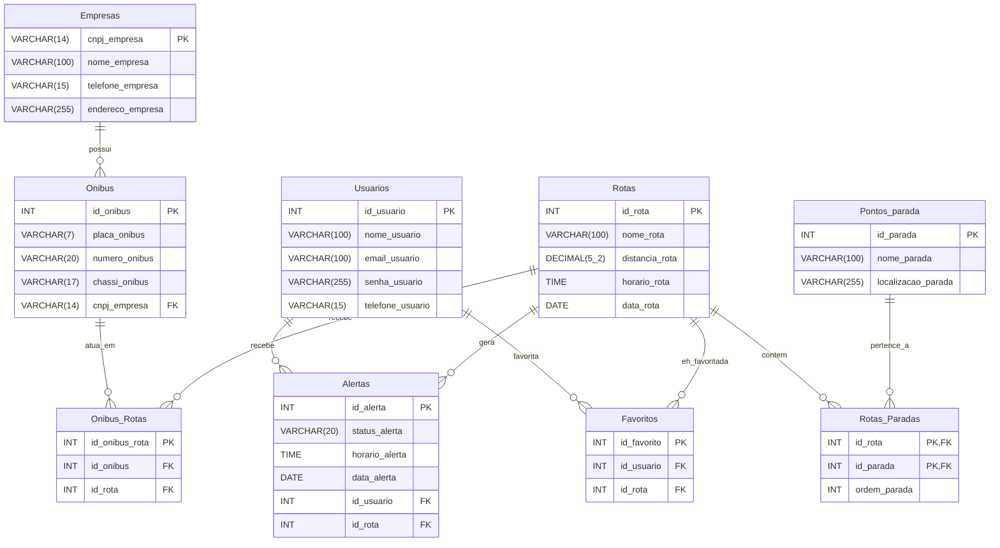

# Vale-Rota
Sistema Inteligente de Transporte Público Intermunicipal
 

 

## Descrição
Aplicativo web responsivo que centraliza horários e rotas intermunicipais, com previsão de atraso baseada em dados históricos de viagens e alertas personalizados para estudantes e trabalhadores.
 

 

## Banco de Dados
### Diagrama ER do nosso sistema

